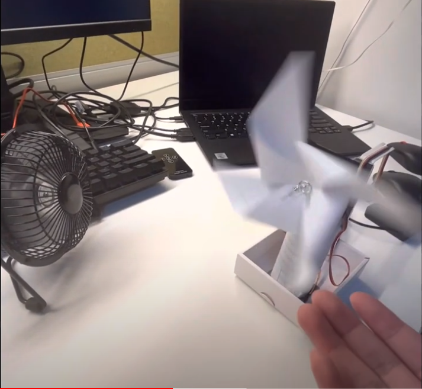

# Auto-Rotate-Windmill
A windmill that will automatically rotate to the direction where it receives the most wind to optimize wind power coming from every directions.
  
The problem with the windmill nowsaday is that their positions are fixed, windmills play an important role in converting windpower to rotational energy using vanes called sails or blades, they will be placed facing directly to where they are caculated to receive the most wind. What if one day the wind doesn't come from that same direction anymore or something happends to the surface that makes the wind completely change its direction? Instead of rebuild or manually change direction of the whole windmill, this Auto-rotate Windmill project of mine will be the perfect answer.

(A small presentation and demo will be shown below, please click on the image)

*Note: the windmill in this project is built with paper, and the origami doesn't look very well, the reason behind that is I want to deliver the idea more than just the apprearance.
